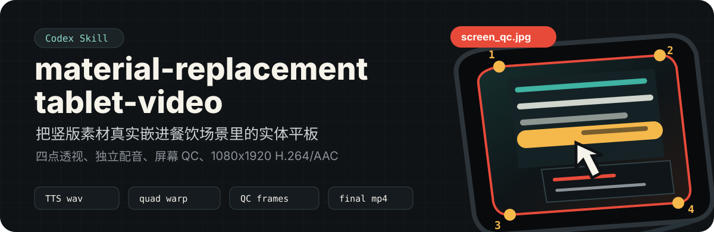

# material-replacement-tablet-video

<p align="center">
  
</p>

这是一个 Codex Skill：把竖版视频、团购海报长图或页面截图嵌入餐饮场景图里的真实平板屏幕，并保留平板外框、圆角、支架、桌面接触关系和现场光线。

它关注的不是“把视频贴上去”，而是让画面看起来真的在 Pad 发光区内播放：四点透视、屏幕内沿坐标、独立配音、H.264/AAC 输出和 `_screen_qc.jpg` 验收图都在流程里。

## 适合用在

- 短视频素材替换：把现成竖版视频放进餐饮场景平板。
- 团购卡券推广：把公开权益提炼成动态平板海报，再合成配音。
- 批量本地生活视频：每张场景图单独检测屏幕边界，每条成片使用独立音频。
- 返工验收：用红色四角 QC 图判断内容是否贴合屏幕发光区内沿。

## 产物标准

| 项目 | 要求 |
| --- | --- |
| 输出视频 | `1080x1920`、`30fps`、H.264/AAC |
| 屏幕贴合 | 只覆盖发光区，不覆盖黑色边框 |
| 透视方式 | 优先四点透视，倾斜 Pad 不退回矩形贴图 |
| 音频映射 | 每条视频使用不同 wav，不能多条复用同一条成品音频 |
| 验收文件 | `_screen_qc.jpg` 和 `_preview.jpg` |

## 快速开始

```bash
python3 -m pip install -r requirements.txt
python3 scripts/render_fast.py \
  --scene /absolute/scene.png \
  --page /absolute/page_full.png \
  --audio /absolute/voice01.wav \
  --out /absolute/out.mp4 \
  --preview
```

输入文件含义：

- `--scene`：含实体平板黑屏的餐饮场景图。
- `--page`：宽度约 720px 的屏幕内容长图或海报图。
- `--audio`：本条视频对应的 wav。
- `--preview`：额外输出屏幕四角 QC 图和 4 帧验收拼图。

如果自动识别屏幕不稳，手动指定屏幕发光区四角：

```bash
python3 scripts/render_fast.py \
  --scene /absolute/scene.png \
  --page /absolute/page_full.png \
  --audio /absolute/voice01.wav \
  --out /absolute/out.mp4 \
  --quad x0,y0,x1,y1,x2,y2,x3,y3 \
  --preview
```

`--quad` 的顺序是：左上、右上、左下、右下。坐标必须落在黑色边框内侧 2-6px。

## 可选：先生成配音

内置 `scripts/youdao_tts.py` 可以调用有道 `confucius4-tts` 合成 wav。它是声音克隆接口，参考音频必填。

```bash
python3 scripts/youdao_tts.py \
  --text "这张团购券今天别划走，价格、时间和门店我直接圈给你看。" \
  --ref /absolute/ref.wav \
  --out /absolute/audio/voice01.wav
```

也可以先从人声视频里抽参考音色：

```bash
python3 scripts/youdao_tts.py \
  --prepare-ref /absolute/reference.mp4 \
  --ref-start 0 \
  --ref-dur 10 \
  --set-default
```

注意：合成时会把参考音频和文本上传到 `confucius4-tts.youdao.com`。涉及隐私、授权或客户素材时，先确认再用。

## 批量任务

Windows 或逐条定制坐标时，用 manifest + PowerShell 7：

```powershell
pwsh -File scripts/render_tablet_batch.ps1 -Manifest C:\absolute\batch.json
```

Manifest 示例见 [references/manifest.md](references/manifest.md)。批量时每条 `jobs[].audio` 都要指向不同 wav；可以共用参考音色，但不能复用同一个合成结果。

## 工作流

1. `ffprobe` 检查源视频、清晰内容范围和每条音频时长。
2. 逐张场景图确认屏幕发光区内沿四角。
3. 裁掉源视频的模糊延展边，不用加边方式适配。
4. 生成或映射每条独立音频。
5. 先渲染第一条并查看 `_screen_qc.jpg`。
6. 合格后批量渲染，并用 `_preview.jpg` 抽帧验收。

## 什么时候必须停下来

- 场景图里没有可确认的实体平板屏幕。
- 屏幕边界被反光、亮屏、菜品或手遮挡，无法可靠取四角。
- `_screen_qc.jpg` 的红线没有沿屏幕发光区内沿闭合。
- 裁切源视频会丢失核心权益信息，且不能通过重做素材解决。
- 需要 TTS 但没有可用参考音频，或没有授权上传参考音频和文案。

## 仓库结构

```text
.
├── SKILL.md
├── agents/
│   └── openai.yaml
├── references/
│   ├── manifest.md
│   └── youdao-tts.md
├── scripts/
│   ├── render_fast.py
│   ├── render_tablet_batch.ps1
│   └── youdao_tts.py
└── assets/readme/
    └── hero.svg
```

## 安装到本机 Codex Skills

```bash
git clone https://github.com/784697524-ux/material-replacement-tablet-video.git
mkdir -p ~/.codex/skills/material-replacement-tablet-video
rsync -a --delete --exclude '.git/' \
  material-replacement-tablet-video/ \
  ~/.codex/skills/material-replacement-tablet-video/
```

安装后，向 Codex 提到 `material-replacement-tablet-video` 或“平板素材替换视频”即可触发这个 Skill。

## 依赖

- Python 3.10+
- `ffmpeg` 和 `ffprobe`
- Python 包：`httpx`、`numpy`、`opencv-python`
- Windows 批量脚本需要 PowerShell 7 (`pwsh`)

## 边界

这个仓库只负责生成视频、封面截图、遮罩和验收拼图。只有在用户明确要求时，才会继续写入钉钉 AI 表格或其他业务系统。

License 尚未指定；当前按私有技能仓库使用。
